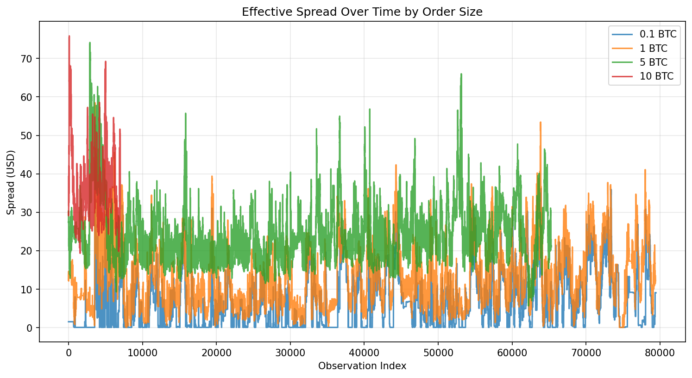
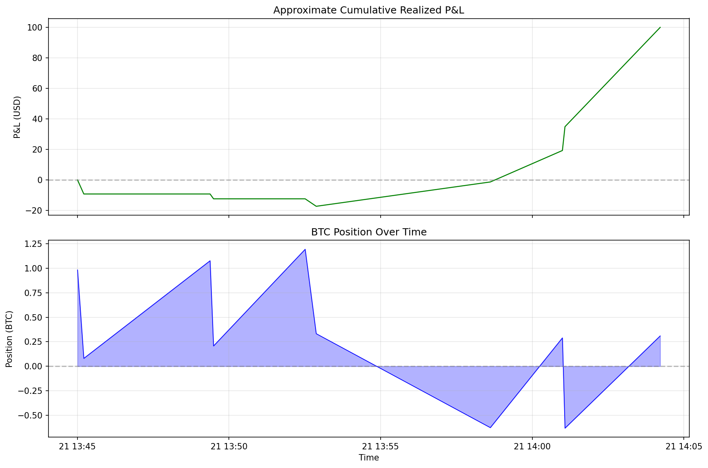

# BTC-USD Market Making Simulator

Real-time market making simulation on BTC-USD using the Kraken public WebSocket feed.

Built as a technical exercise for the Crypto Trading Desk internship at Marex Capital Markets.

## Architecture

```
config.py              Tunable parameters
orderbook.py           L2 order book engine (snapshot + incremental deltas)
trades.py              Real-time trade feed handler
spread_analytics.py    Effective spread computation (VWAP-based, multi-size)
market_maker.py        Adaptive strategy: spread, sizing, skewing, risk
simulator.py           Main loop, dashboard, WebSocket orchestration
export.py              CSV export (trades, spreads)
plots.py               Matplotlib charts (spread history, P&L, position)
```

## Key Features

- **Adaptive spread** anchored to observed market spread, not fixed bps — adjusts in real time
- **Volatility overlay** via rolling realized vol of mid-price log-returns
- **Dynamic quote sizing** scaled by vol regime and remaining risk capacity
- **Position skewing** for inventory mean-reversion
- **Risk management**: $1M max exposure (per-side cancellation), $100K max loss (hard halt)
- **Auto-reconnect** on WebSocket disconnection with state preservation

## Installation

```bash
git clone https://github.com/BBenisti/Market-Making-project.git
cd Market-Making-project
python -m venv venv
.\venv\Scripts\Activate.ps1   # Windows
source venv/bin/activate       # macOS/Linux
pip install -r requirements.txt
```

## Usage

```bash
python simulator.py
```

`Ctrl+C` to stop. Exports `trade_log.csv`, `spread_history.csv`, `spread_history.png`, `pnl_position.png` on shutdown.

## Configuration

All parameters in `config.py`:

| Parameter | Default | Description |
|-----------|---------|-------------|
| `SPREAD_MARKET_MULTIPLIER` | 1.5 | Quote at Nx observed market spread |
| `MIN_SPREAD_BPS` | 0.5 | Absolute floor (bps) |
| `MAX_SPREAD_BPS` | 20 | Absolute ceiling (bps) |
| `VOL_SENSITIVITY` | 0.5 | Spread widening per unit of vol |
| `SPREAD_REFERENCE_SIZE` | 1.0 | Spread measured for this size (BTC) |
| `BASE_QUOTE_SIZE_BTC` | 1.0 | Max quote size at zero risk utilization |
| `SKEW_FACTOR` | 2.0 | Position skew aggressiveness |
| `MAX_NOTIONAL_EXPOSURE` | $1M | Hard exposure limit |
| `MAX_LOSS` | $100K | Hard loss limit (halts strategy) |

## Sample Output

```
  Mid Price:    $   76,438.85       Realized Vol: $   0.20
  Bid: $76,425.60    Ask: $76,444.10    Half-Spread: $9.25
  Quote Size: 0.9452 BTC

  Position:    0.310000 BTC    Exposure: $23,696    Total P&L: +$51.75
  Fills: 10
```

## Sample Charts




## Tech Stack

Python 3.12+ — websocket-client, NumPy, Pandas, Matplotlib
